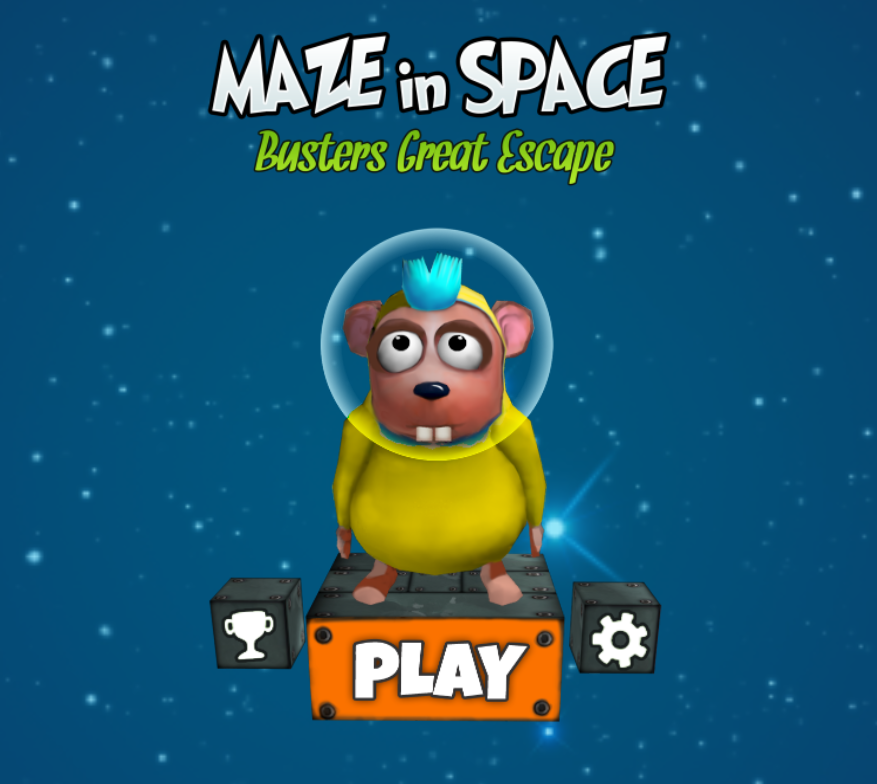

# MazeInSpace
Experience crazy labyrinths on a 3D maze somewhere in the space. The player is called Buster and is a little space rat astronaut lost in space. 

## Game description
Space rat astronaut Buster is lost in space! Can you help him  to
get back home to earth?

Turn the cubes and put those cubes to the right place on the maze.
Move the labyrinth and lead Buster through the crazy space labyrinth to the target!

Jump trough wormholes from one maze labyrinth to another one
and help Buster, ultimately successful getting back home to earth.

Features:
* Innovative game concept
* Levels with increasing difficulty
* Journeys through different worlds

## Start the game
Open the folder **Game_Webversion** and run the **index.html**. 
A Browser will be opened and then - let the games begin!

## Gamecontrol
* The maze and the little cubes can be turned by holding the mouse clicked and throwing around.
* Let the cube move on a surface of the maze get moved into the maze by clicking on a surface of the maze.
* Get Buster running by clicking on the target cube surface, where he have to go.
* You can see the state of the game at the navigation bar at the central bottom positioned button.
* Depending on the state of the game you can do different actions by clicking on this button.
* A menu offers you to leave the game and start a new one.
